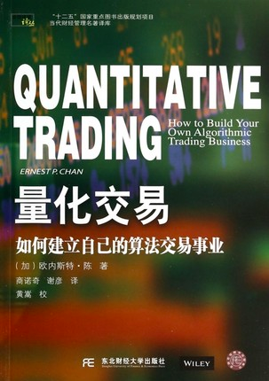

# QuantitativeTrading
量化交易



````

商品名称：	量化交易(如何建立自己的算法交易事业)/当代财经管理名著译库	
开本：	    4
作者：	    (加)欧内斯特·陈|译者:商诺奇//谢彦|校注:黄嵩	页数：	
定价：	    28	
出版时间：	2014-01-01
ISBN号：	9787565413254	
印刷时间：	2014-01-01
出版社：	    东北财大	
版次：	    1
印次：	1
````
